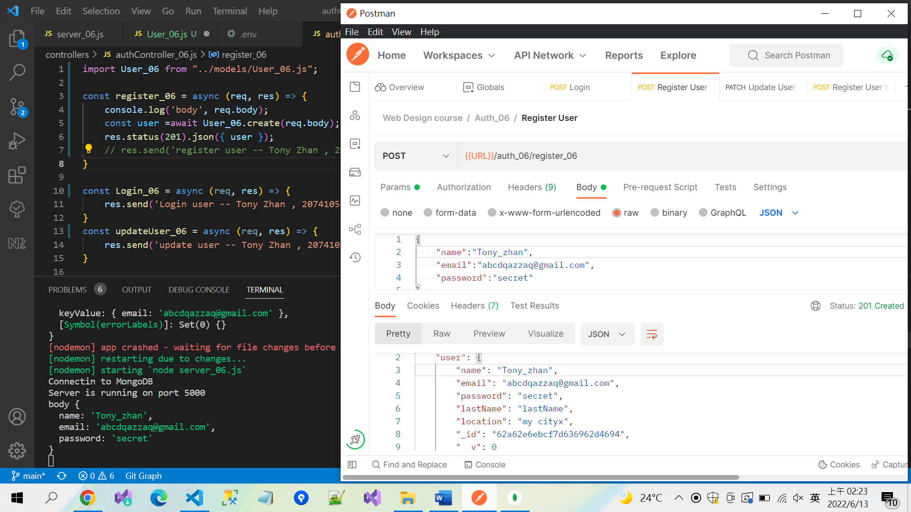
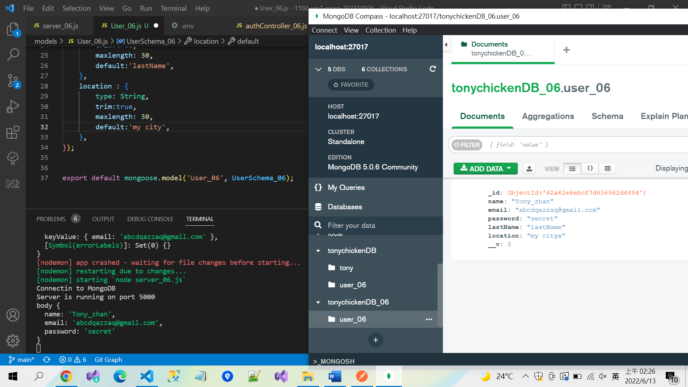

### Postman Create User And Update to MongoDB

### Middelware Error page-code 500 

### 83、84 gersalt for random AND JWT.sign for encode that work User secret (use Postman test this API)

### git log 紀錄

