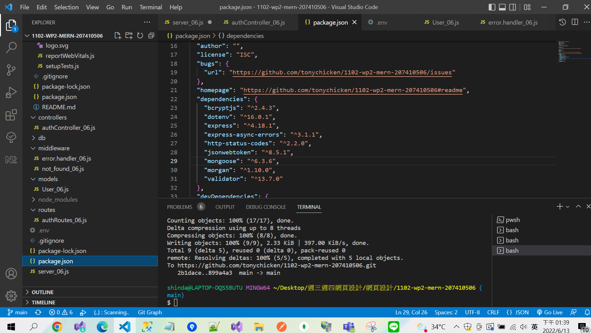
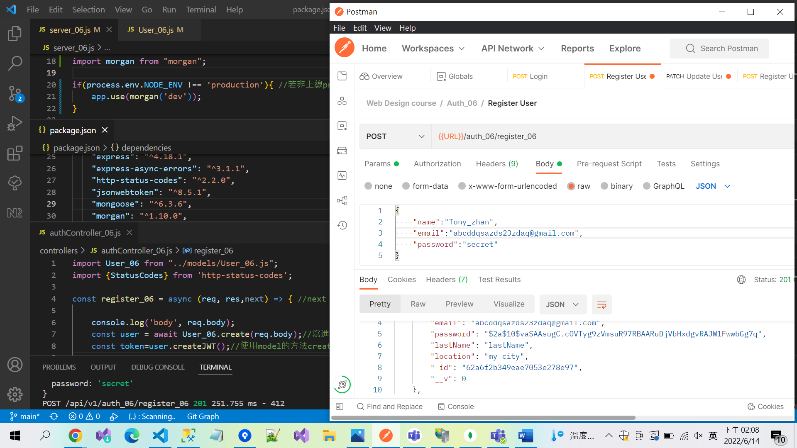

### package.json install new tools(morgon(開發看return用) statuscode(201、500、404.....) concurrently (整合前後端一起npm start))

### concurrently (整合前後端一起npm start)

### 成功連進線上Mongodb Atlas之設定

### 成功連進git log 紀錄

